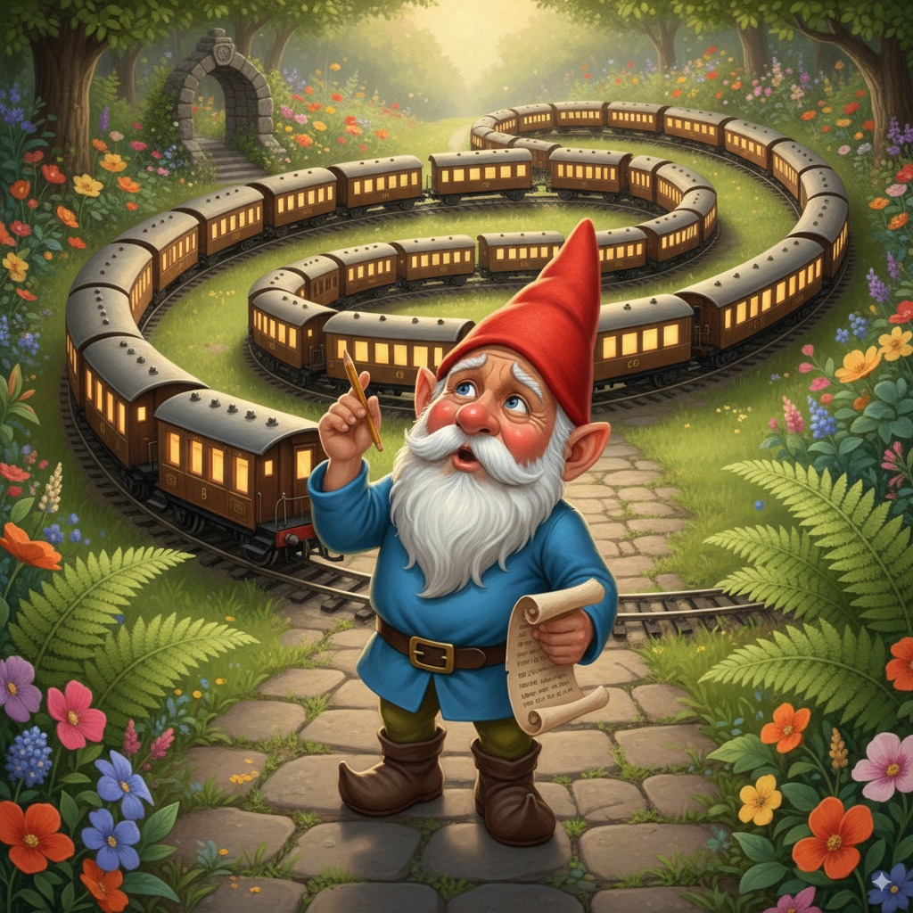
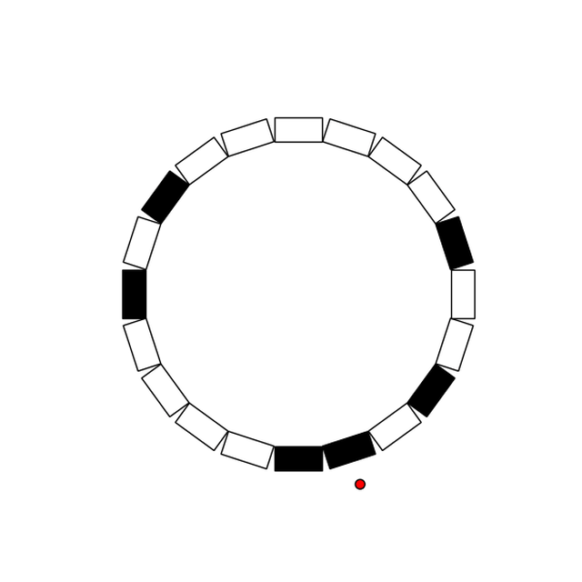

# The Train Enigma




Welcome to **the Train Enigma**!

Your mission is to help **Dwarfy** in his latest challenge: **counting wagons in a circular train**.

At first glance, counting wagons sounds simple. Unfortunately for Dwarfy (and you), these trains are circular, making the task much trickier.

# 🚂 The task
The train consists of an unknown number of wagons (potentially very large).
Each wagon can be either lit or unlit, with an unknown and random distribution.

Dwarfy can only perform **four actions**:

- Move to the wagon on the **right**.
- Move to the wagon on the **left**.
- **Toggle** the wagon’s light.
- **Declare** the final wagon count.

Your goal: design a method that allows Dwarfy to **determine the exact number of wagons in the train**.

# 🧑‍💻 How to participate
To participate, you need to implement a solver:

1. Create a subclass of the Solver class.
2. Implement the get_next_step method.
    - It takes the current wagon’s state (lit or unlit) as input.
    - It must return an iterable of actions for Dwarfy to perform.
You can start by editing the my_solver file, which has already been prepared for you.

When your solver decides to stop:
- It must return the END action.
- Before doing so, make sure to set the wagon_count attribute to the final number of wagons you computed.

👉 To submit, simply send me the code of your solver.

# 🧪 Testing Your Solver
You can test and benchmark your solver using the included scripts:

## Solver Tester

Use `solver_tester.py` to run your solver against predefined test cases (found in the `test_cases` folder).
The test cases are split into three categories: **small**, **medium**, and **big** trains.

Example usage:
```bash
python solver_tester --solver_file_path path/to/your/solver --test_subset [small, medium, big]
```


## Visualizing the Solver
Use `viz_solver` to see how your solver behaves step by step on a given train configuration.

Example usage:
```bash
python viz_solver.py --solver_file_path path/to/your/solver --train_file_path path/to/train.npy --viz_fps <fps> --n_wagons <n>
```

For example, here’s the visualization of a simple solver that switches off each light and then moves right:




Code for this example solver:
```py
from typing import Iterable
from solvers.solver import Actions, Solver


class Example(Solver):
    def get_next_step(self, cur_wagon_state: bool) -> Iterable[Actions]:
        if cur_wagon_state:
            return [Actions.SWITCH_LIGHT, Actions.MOVE_RIGHT]

        return [Actions.MOVE_RIGHT]
```

# 📊 Benchmarking
All submitted solvers will be benchmarked on a **private test set** consisting of both random and manually designed trains.

Evaluation metrics:
- **Primary metric**: number of steps taken.
- **Additional tracking**: execution time and memory usage.

✅ Only solvers that pass all test instances will be included in the leaderboard.

(**WIP**: leaderboards and graphs will be added later.)

